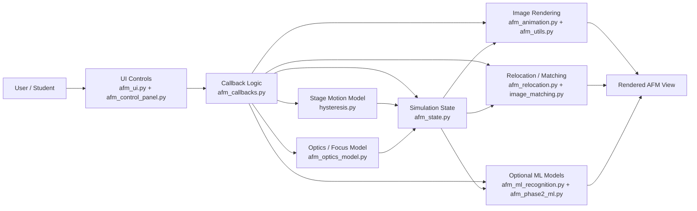
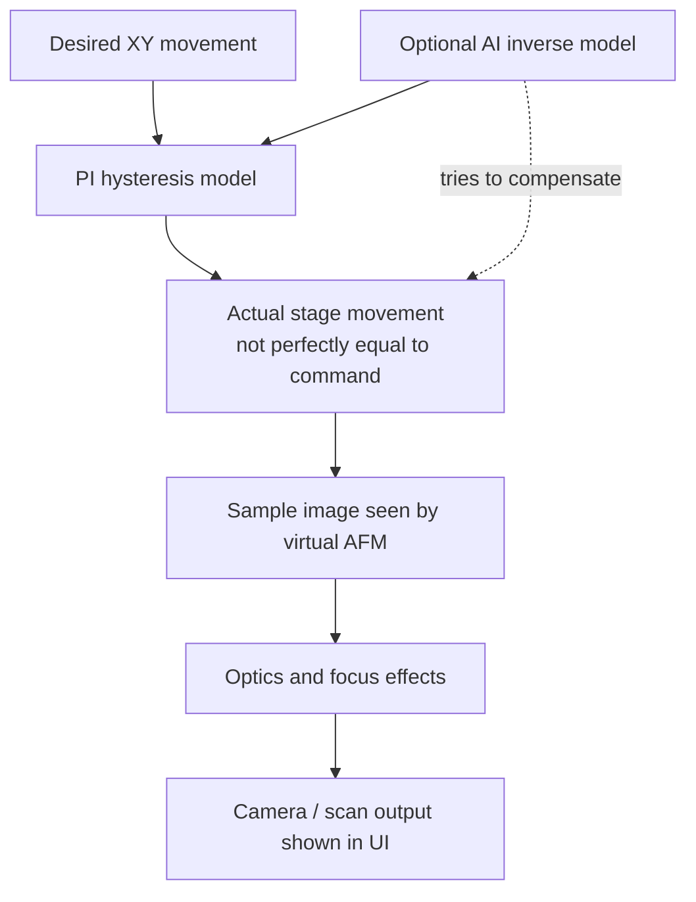
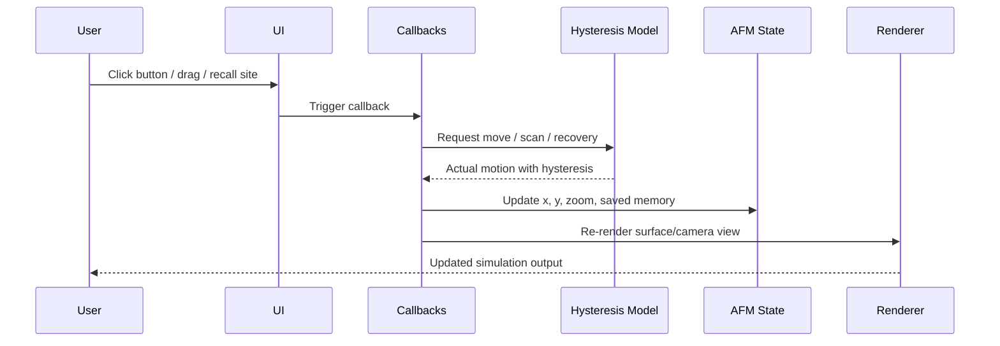
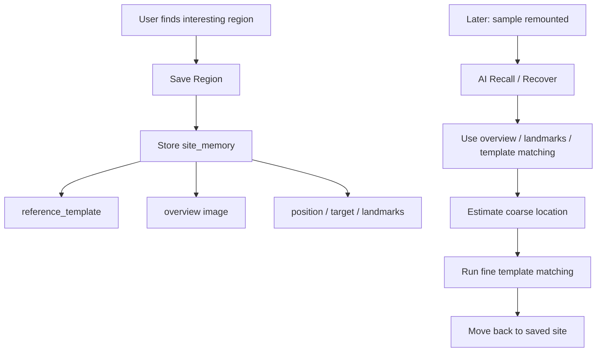
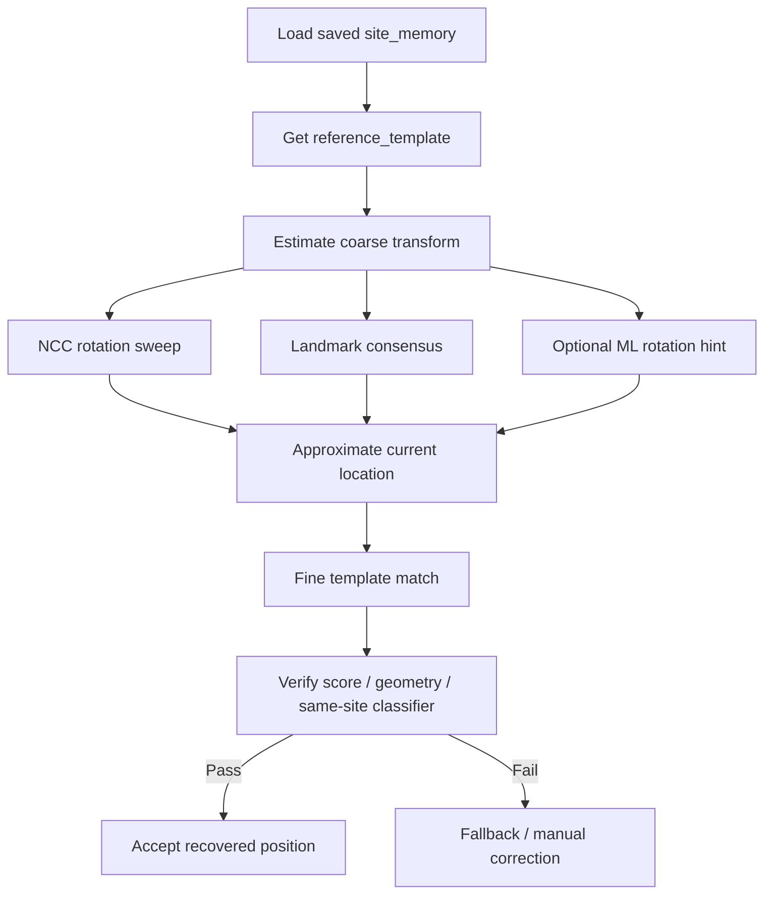
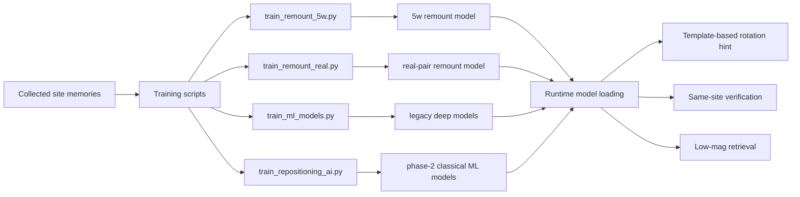
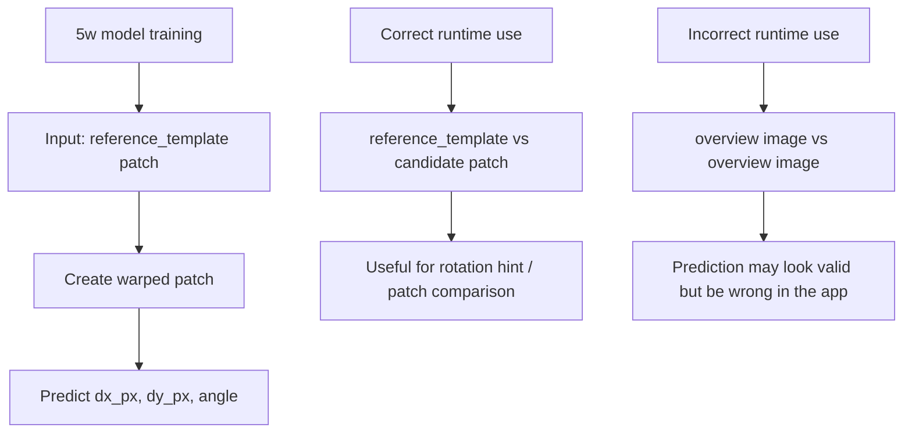

# AFM Hysteresis Simulation: Visual Overview

Mermaid is a good fit here because it is lightweight, readable in plain text, and easy to update as the project changes.

## 1. Big Picture

## 2. What The Program Is Simulating

## 3. Main Runtime Flow

## 4. Save Region And Recall Concept

## 5. Relocation Logic

## 6. Where Machine Learning Fits

## 7. Important Clarification About The New 5w Model

## 8. File Map

```mermaid
flowchart TD
    UI[UI Layer] --> UI1[afm_ui.py]
    UI --> UI2[afm_control_panel.py]
    UI --> UI3[afm_callbacks.py]

    CORE[Simulation Core] --> C1[hysteresis.py]
    CORE --> C2[afm_state.py]
    CORE --> C3[afm_animation.py]
    CORE --> C4[afm_optics_model.py]

    VISION[Vision / Relocation] --> V1[afm_relocation.py]
    VISION --> V2[image_matching.py]
    VISION --> V3[afm_phase2_ml.py]

    ML[ML / Training] --> M1[afm_ml_recognition.py]
    ML --> M2[train_remount_5w.py]
    ML --> M3[train_remount_real.py]
    ML --> M4[test_5w_model.py]
    ML --> M5[train_ml_models.py]
```

## 9. Plain-English Summary

This project is not only a machine learning project.

It is mainly:

1. A simulation of AFM stage behavior with hysteresis.
2. A virtual imaging system that shows what the AFM would see.
3. A relocation system that tries to return to the same sample site after remounting.
4. An optional ML-assisted layer that helps with recognition and recovery, but does not replace the full classical pipeline.

